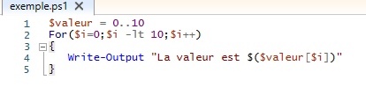
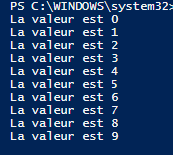

# Les boucles   

## Les boucles, dans tout langages de programmation, sont des commandes classiques et inévitables que tout le monde connaît. Il s'agit d'une commande répétant un code plusieurs fois, jusqu'à atteinte de son objectif.   

- ### Structure d'une boucle **For**   

    - > For(*état initial*; *condition de répétition*; *incrémentation*)   
       {   
        Si la boucle est valide, le code afficher ici est exécuté.   
       }   
       Sortie de la boucle si la *condition de répétition* est fausse.          
       
     -     
     - Ici, on crée un tableau de int de 0 à 10, puis avec la boucle ``for``, on initialise la variable ``i`` de valeur 0 et tant que i est inferieur à 10, on lui rajoute +1 après avoir lu la boucle 1 fois. La boucle va donc à chaque itération, écrire en sortie "La valeur est (valeur de i)   
    -  Elle s'arrête à 9 car dans le ``-lt 10`` le 10 n'est pas compris.   

