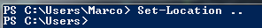
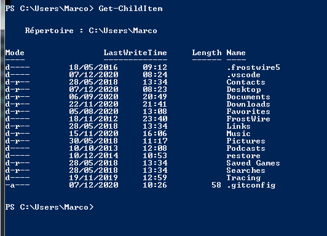

# Les commandes  pour les nuls 

En tant que nuls, vous connaissez peut-être déjà quelques commandes de base sous Linux. Figurez-vous qu'elles ont toutes un équivalent Powershell.   
Pour les connaître, la première commande à éxecuter est    
> ## Get-Alias 
   
Elle permet de lister toutes les commandes qui peuevent être exécuter comme cela :    
On y trouve sur une ligne le nom de la commande sous Linux :    
Et juste après, son équivalent Powershell, ici Set-Location : 

>## Set-Location   
On en parlait juste avant, la commandes de déplacement entre des fichiers est celle ci-dessus. Elle permet de rentrer dans un fichier. Il suffit de déterminer le *chemin* à prendre comme ceci :  ce qui donne après .

Vous savez coment rentrez dans un dossier etc mais dîtes-moi... Savez-vous en sortir ? Pour ce faire, il suffit de mettre comme *chemin* " .. "   

>## Get-ChildItem

Cette commande vous permet de lister les différents fichiers et dossiers présents à l'endorit où vous êtes :   

Si vous voulez plus de précision sur les élements présents sur l'image juste au dessus, allez regardez la page [droits](https://github.com/taobourmaud/Linux_dossier/blob/main/droits.md).    

[Retour au sommaire](https://github.com/taobourmaud/Linux_dossier/blob/main/README.md)

