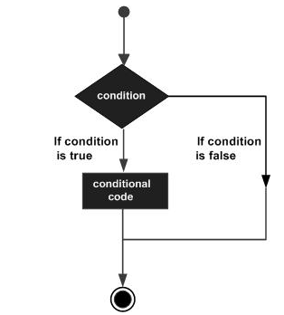
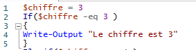
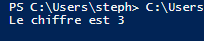
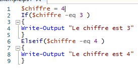
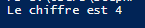
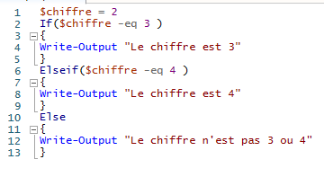
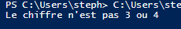

# Les conditions   

## Une condition est un expression booléenne suivie d'une ou plusieurs instructions. Si l'instruction demandée est vraie, alors la condition est remplie et le code exécute ce qui est demandé si la condition est remplie. 
   

- ### Structure d'une condition   
    - ``If``  
        - 
        Ce script va donc afficher :   
        -   Si la 1ère condition n'est pas vraie alors l'instruction n'est pas exécutée.
    - ``Elseif``   
        - Ainsi, on peut enchaîner plusieurs conditions pour qu'au moins une de nos conditions soit vraie. 
        - 
        - Ici la variable chiffre vaut 4 donc la 1ère condition est fausse et donc évitée.
        -    
        - On peut donc en mettre autant que possible.   
    - ``Else``   
        - Cette condition se place seulement en derniere. Elle permet de suivre une instruction si toutes les conditions précedentes étaient fausses.   
        - 
        -    
- ### Fin de condition   
    - Le code s'arrête et sort des conditions à partir du moment où il en trouve une de vraie. Par exemple, si le ``if`` est faux mais que le ``elseif`` est vrai, alors le ``else`` ne sera même pas vérifié.  

[Retour](lien vers script)