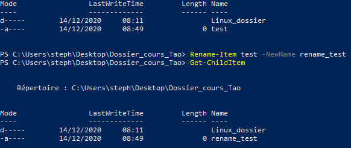
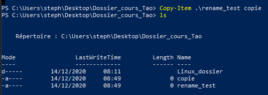

# Gestion des fichiers/dossiers   

- ### Création d'un dossier   
    - ```New-Item + nom_du_dossier + -ItemType Directory```
- ### Création d'un fichier   
    - ```New-Item + nom_du_fichier```
- ### Supprimer un fichier ou un dossier   
    - ```Remove-Item + nom_du_fichier/dossier```   
- ### Supprimer un dossier non-vide   
    - ```rmdir -f + nom_du_fichier```   
- ### Déplacements entre dossier   
    - Pour rentrer dans un dossier   
        -  ```Set-Location + nom_du_dossier_où_aller```  
    - Pour sortir d'un dossier   
        - ```Set-Location .. ```  
- ### Renommer un fichier   
    - ```Rename-Item nom_du_fichier -NewName nouveau_nom_du_fichier ```  
        - Exemple :    
- ### Copier un fichier   
    - ```Copy-Item nom_du_fichier nom_de_la_copie```   
        - Exemple :    

[Retour au sommaire](https://github.com/taobourmaud/Linux_dossier/blob/main/README.md)
        