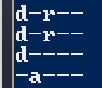

# Les droits pour les nuls   

Lors de l'utilisation de la commande **Get-ChildItem**, une colonne intrigante s'est affiché.  Sur cette image, on peut voir plusieurs lettres diférentes affichées avec des tirets entre. Ces lettres représentes les droits appliqués sur un fichier/dossier. Les droits marchent par trio et il en éxiste 8 différents. Chaque combinaison à une valeur afin de pouvoir modifier les droits sur un fichier ou dossier : 

>---   : aucune droit, valeur = 0   
>--x   : droit d'exécution seulement, valeur = 1   
>-w-   : droit d'écriture seuelement, valeur = 2   
>-wx   : droit d'écriture + droit d'exécution, valeur = 3   
>r--   : droit de lecture seuelement, valeur = 4   
>r-x   : droit de lecture + droit d'exécution, valeur = 5   
>rw-   : droit de lecture + droit d'écriture, valeur = 6   
>rwx   : tout les droits, valeur = 7   

Mais sur une ligne de permissions, il ya 10 caractères et non 9. En effet le 1er sert à définir le type de fichier.

- Types de fichiers   
    - d : répertoire  
    - l : lien symbolique   
    - c : périphérique de type caractère   
    - b : périphérique de type bloc   
    - p : pipe (" | ")   
    - s : socket   
    - -: fichier classique (c'est un tiret " - ")   

[Retour au sommaire](https://github.com/taobourmaud/Linux_dossier/blob/main/README.md)