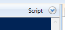
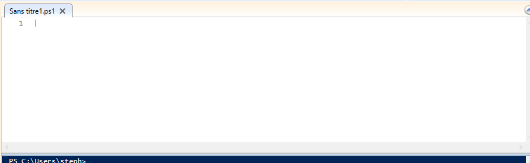
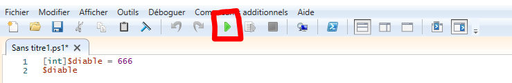
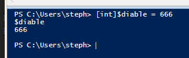

# Les scripts   

L'utilisation de script ne se fait pas sur powershell directement, mais sur un outil appelé *Powershell_ISE*.     

- Il éxiste 2 manières de le lancer;   
    
    - Comme pour Powershell, il suffit tout simplement de rechercher *Powershell_ISE* dans le menu démarrer puis de le lancer comme ceci :    

   
    - Une commande permet sinon de l'exécuter depuis Powershell;   
        - ```powershell_ise.exe```   
        -    

Avant de commencer, il faut savoir que les scripts ne peuvent pas être lancé simplement au cas où ils pourraient endommager votre machine.   

## Politique de réstriction des scripts ?    

> Une politique restreint l’exécution des scripts. ( blog.netwrix )   

- Consulter cette politique   
    - ```Get-ExecutionPolicy```   
       
    - valeur de restriction :   
        - >Restricted — Aucun script n’est autorisé. Il s’agit du paramètre par défaut, que vous verrez donc lors de votre première exécution de la commande.
        - > AllSigned — Vous pouvez exécuter les scripts signés par un développeur de confiance. Ce paramétrage vous demandera, avant l’exécution d’un script, de confirmer que vous souhaitez bien l’exécuter.
        - >RemoteSigned — Vous pouvez exécuter vos propres scripts ou les scripts signés par un développeur de confiance.
        - >Unrestricted — Vous pouvez exécuter tous les scripts que vous voulez.    
 

- ### Ecrire un script   
    - Sur Powershell_ISE il suffit de cliquer sur ce bouton :    
    - Après cela, la page suivante apparait et vous n'avez plus qu'à écrire votre script :    
- ### Exécution d'un script   
    - Pour exécuter un script il faut appuyer sur ``F5`` ou bien ce bouton :    
    - Le script s'éxecute dans " l'invit de commande " de powershell_ise : 


## Dans les scripts, on retrouve souvent différentes choses comme les [*Pipeline*](https://github.com/taobourmaud/Linux_dossier/blob/main/pipeline.md) , les [*variables*](), les [*boucles*](), les [*conditions*]() etc.  


[Retour au sommaire](https://github.com/taobourmaud/Linux_dossier/blob/main/README.md)  
        