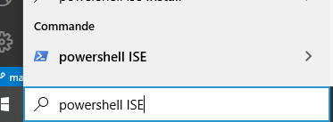

# Les scripts   

L'utilisation de script ne se fait pas sur powershell directement, mais sur un outil appelé *Powershell_ISE*.     

- Il éxiste 2 manières de le lancer;   
    
    - Comme pour Powershell, il suffit tout simplement de rechercher *Powershell_ISE* dans le menu démarrer puis de le lancer comme ceci :    

   
    - Une commande permet sinon de l'exécuter depuis Powershell;   
        - ```powershell_ise.exe```   
        -    

Avant de commencer, il faut savoir que les scripts ne peuvent pas être lancé simplement au cas où ils pourraient endommager votre machine.   

## Politique de réstriction des scripts ?    

