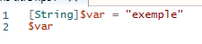
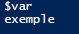
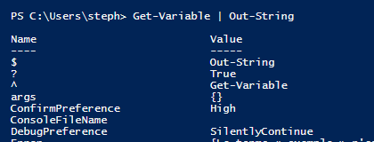
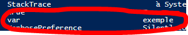
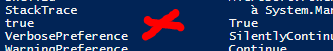

# Les Variables   

### Variable : Unité de mémoire permettant le stockage de valeurs. Le symbole $ permet la création de celle-ci, par exemple la variable ```$exemple```. On peut lui attribuer une donnée grâce au symbole = et afficher son contenu après en écrivant simplement le nom de la variable.   

- ### Types de variables   
    - String ```[String]$exemple = "lettre"```  
    - Char ```[Char]$exemple = charactères %$#```
    - Int ```[Int]$exemple = 123```
    - Date-Time ```[Date-Time]$exemple = get-date```
    - Array ```[Array]$exemple = ligne, du, tableau```
    - Bool ```[bool]$exemple = true (ou false)```
    - Il y en a d'autres mais pas importantes comparé à celle ci-dessus.   

- ### Définir une variable   
    - ```[type de variable]$nom_variable = valeur_attribuée```   
    - Exemple :    
        - Dans cet exemple, on déclare une variable de type ``string`` qui a pour nom "var".   
        - Elle a pour valeur "exemple". La valeur "exemple" est donc stockée dans la variable ``var``.   
        - La seconde ligne nous permet d'appeler notre variable ``var``, ainsi, en lançant notre script, il va nous afficher la valeur de ``var`` c'est à dire "exemple".    
- ### Afficher mes variables   
    - ``Get-Variable | Out-String``   
        -    
        - On retrouve bien dans cette liste notre variable ``var`` avec sa valeur :    
- ### Supprimer une variable   
    - ``Remove-Variable -name var #without $``   
        - Cette commande supprime la variable notée après ``-name``, en l'occurence ici la variable ``var``.   
    -    
        - Comme on peut le remarquer, ``var`` n'est plus après ``true``.   


[Retour](https://github.com/taobourmaud/Linux_dossier/blob/main/script.md)
